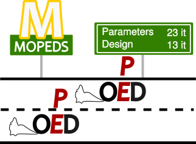

# Introduction



`mopeds` - **Mo**del based **P**arameter **E**stimation and **D**esign of Experiment**s** is a library wrapped around [CasADi](https://web.casadi.org/) to solve Simulation / Optimization problems based on steady state and dynamic models. Features:

- Top level abstraction around [CasADi](https://web.casadi.org/) in the form of **Variable**, **Simulator** and **Optimizer** classes
- Finding solution of steady-state and dynamic models
- Solving parameter estimation (**PE**) and optimal experimental design (**OED**) design 

The project is still in development phase, so the API may change.
We are looking for case studies and testers, so if you have any problems using the package or have any questions, do not hesitate to contact [Volodymyr Kozachynskyi](mailto:vovakozach@gmail.com).

**mopeds** is developed by Volodymyr Kozachynskyi at the [Process Dynamics and Operations](https://www.tu.berlin/en/dbta) group at TU Berlin lead by Jens-Uwe Repke.

## Installation

`pip` Installation:

```
pip install mopeds
```

## Citation

If you use `mopeds` in your research, please cite the Zenodo archive or one of the accompanying publications.

> Kozachynskyi, V. (2026). *mopeds – Model based Parameter Estimation and Design of Experiments* (Version 0.11.0). Zenodo. DOI: [10.5281/zenodo.20939503](https://doi.org/10.5281/zenodo.20939503)

See the [Publications](publications.md) page for related publications.

## Contributors

Many people have been involved in the development of this package, either by writing actual code, helping with the methods behind it, or simply using it and providing feedback and feature requests. Here are just a few names:

- Dario Staubach
- Martin Bubel
- Lorenz Hafner
- Mudassar Javed
- Torben Talis
- Joris Weigert
- Erik Esche
- Markus Illner
- Christian Hoffman
- Georg Brösigke
- Maria Stockman

and many, many others ...

## Acknowledgement

This work is funded by the Deutsche Forschungsgemeinschaft (DFG, German Research Foundation) - 56091768 and 466397921.
